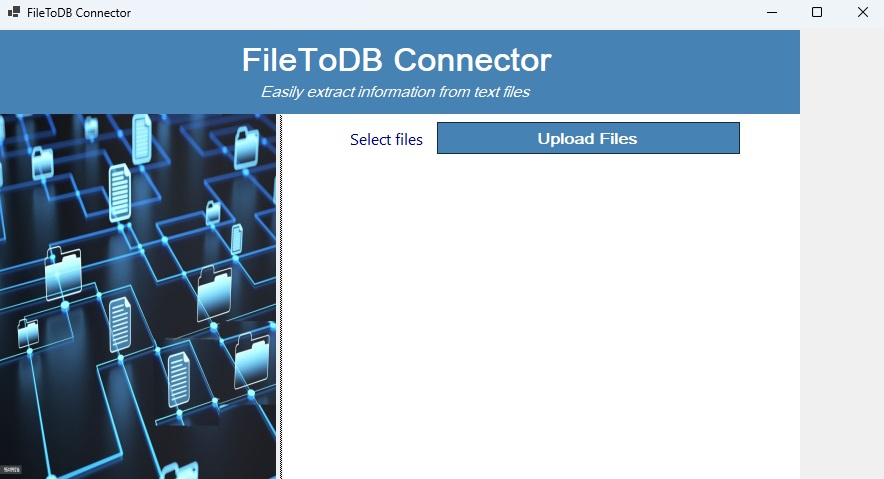
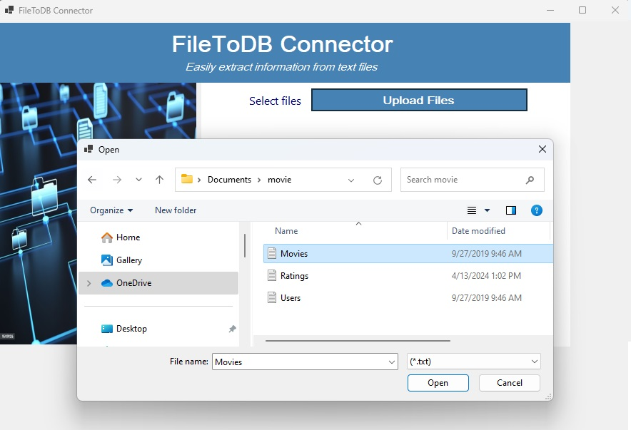
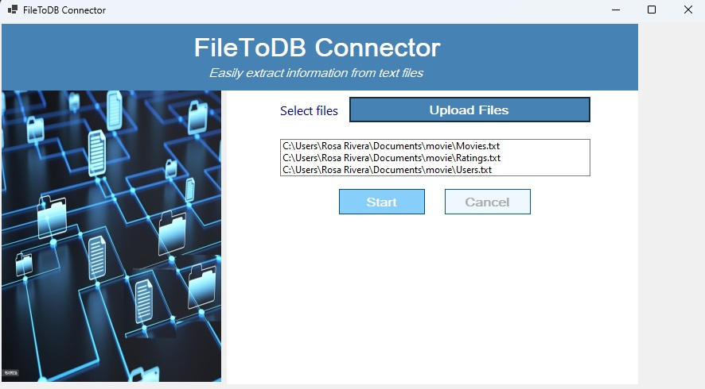
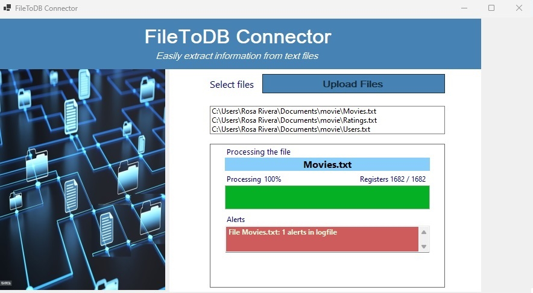
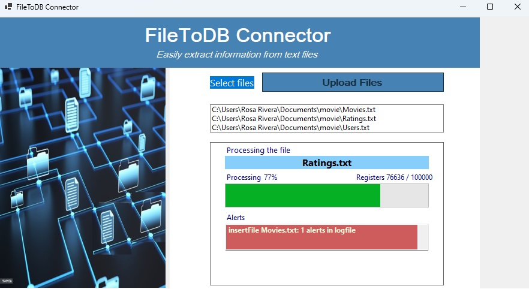
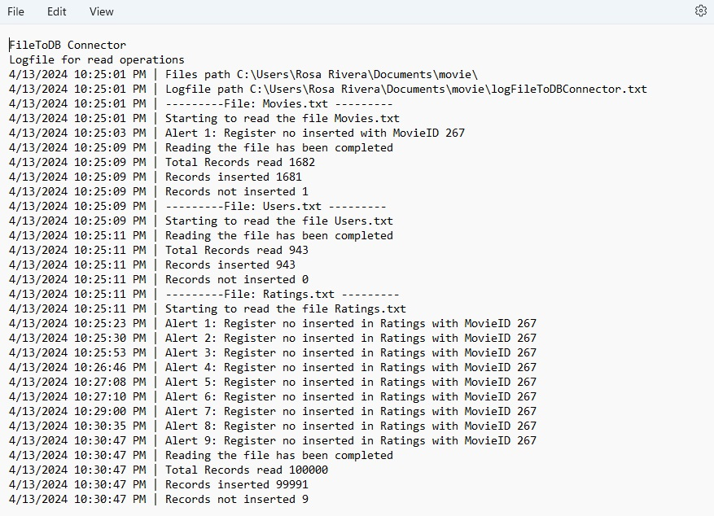

# FileToDB Connector

FileToDB Connector is a desktop application using Windows Forms developed in C# that allows users to upload and process text files containing data related to movies, users, and ratings. It reads the files, performs validations, and inserts the data into a database.  

## Features

- **User Interface**: The application provides a user-friendly interface with progress reporting functionality to keep users informed about the status of file processing and database insertion.  
- **Upload Text Files**: Users can upload one or multiple text files (.txt) containing data.
- **Database Connection Management**: Consider using connection pooling and implementing proper connection open/close mechanisms to minimize resource usage and improve performance.
- **Process Files**: The application processes the uploaded files, extracting relevant information and inserting it into a database.
- **Logging**: Implement logging and auditing features to record important events, actions, and errors that occur within the application.  
- **Error Handling and Reporting**: Implement robust error handling mechanisms to gracefully handle errors that may occur during file reading, data processing, or database insertion.

## Installation

1. Clone the repository or download the source code.
2. Open the solution in Visual Studio.
3. Build the solution to ensure all dependencies are resolved.
4. Run the application.

## Usage

1.Launch the application.

**Image #1. Main view**

2.Click on the "Upload Files" button to select one or more text files containing data (movies, users, or ratings).

**Image #2. Uploading files**

3.Once files are uploaded, click on the "Start" button to begin processing the files or or "Cancel" to come back to the Upload Files button.

**Image #.3 Start option**

4.Progress indicators will show the processing status.

- **File Name**: Indicates the name of the file currently being processed.
- **Percentage**: Shows the completion percentage of the processing task.
- **Number of Records**: Displays the total number of records being processed.
- **Alerts**: Displays the alerts occured during the process.

**Image #4. Movies progress indicator**

**Image #5. Users progress indicator**

**Image #6. Ratings progress indicator**

5.After processing, users can view a log with details operations, alerts and numbers of records inserted ckick on the See Log button.

**Image #7 See Log button**

**Image #8 Logfile**

## Dependencies

- Microsoft.Data.SqlClient: ADO.NET provider for SQL Server to interact with the database.
- System.ComponentModel, System.Data, System.Diagnostics, System.Text: Standard .NET libraries for data manipulation and UI components.

## Contributing

Contributions are welcome! Feel free to fork the repository, make changes, and submit pull requests.
